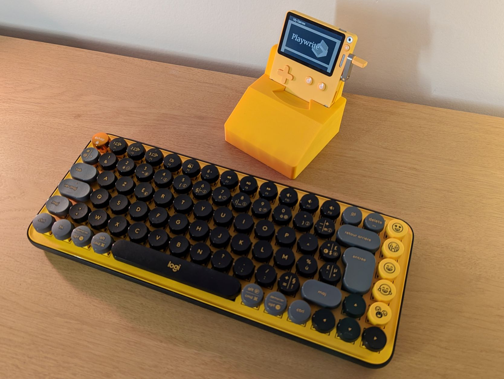
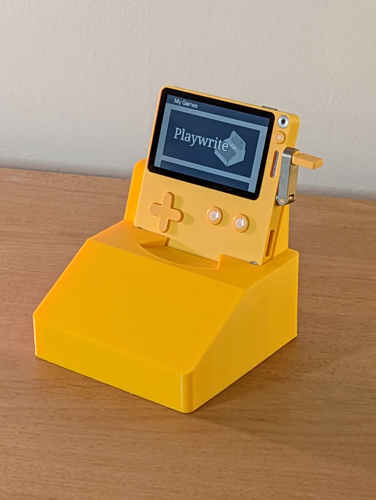
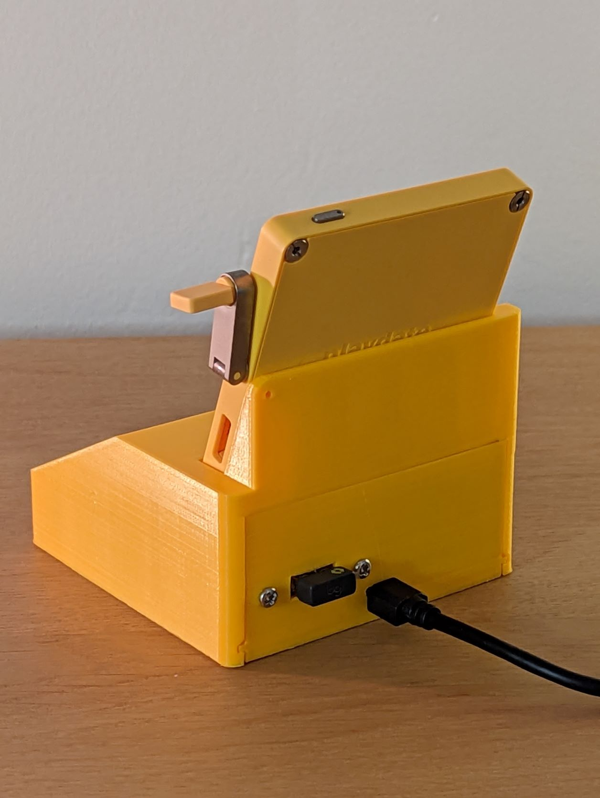
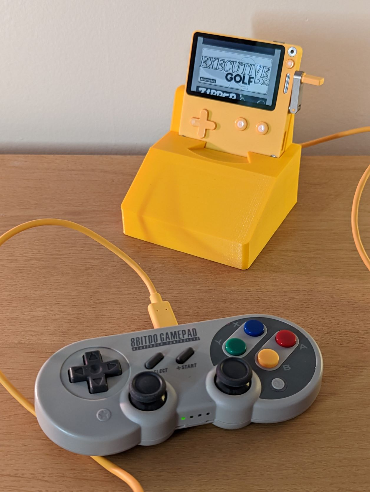

# Playwrite dock

A keyboard and gamepad adapter dock for [Playdate](https://play.date), mainly designed for use with the [Playwrite experimental word processor](https://github.com/t0mg/playwrite), but compatible with any other Playdate game or app.

**Overview thread with demo videos: https://twitter.com/t0m_fr/status/1576949261849149440**

This repo is dedicated to the dock; it contains: 
- Source code for the Teensy microcontroller board (as a PlatformIO project)
- CAD and STL files for the 3d-printed dock (see [here](https://github.com/t0mg/playwrite-dock/tree/master/dock) for pictures and instructions)

For the Playwrite app for Playdate, see [here](https://github.com/t0mg/playwrite).

## Dock overview

  

The dock is powered by a [Teensy 4.1 microcontroller](https://www.pjrc.com/store/teensy41.html). The USB Host port of the Teensy is used to connect to both a [Playdate](https://play.date/) console and a USB HID keyboard (or gamepad). It reads user input from these devices and uses USB Serial to communicate with the Playdate, leveraging a few of the available [USB commands](https://github.com/jaames/playdate-reverse-engineering/blob/main/usb/usb.md#usb-commands) to emulate inputs, and listening to messages from the Playdate and [Playwrite app]((https://github.com/t0mg/playwrite)). 

The micro USB port of the Teensy is used to power the dock and flash the software. The dock also charges the Playdate though the Teensy (albeit slowly).

## Keyboard in controller mode

Arrow keys, Enter and Escape are directly mapped to the directions, A and B buttons respectively (and so are the A and S keys when not in the dedicated [Playwrite app](https://github.com/t0mg/playwrite). So the keyboard can be used anywhere in the OS or in games that don't rely on the crank (not because it's unusable; but because it's just not convenient).

## Full keyboard mode

The Playwrite app sends a specific command to the serial console (`KeyboardInputEnable`) to let the Teensy know that it can enable the "keyboard mode". In this mode, encoding keyspresses are encoded as `crankchange` angles in the dock (and decoded back to chars in the Playwrite app on the Playdate).

## USB Gamepad

The dock software also supports USB Gamepads to some extent (tested on a couple of 8bitdo devices). This part of the project might arguably the most generally useful, as it could improve accessiblity of the device without the need of a full computer. 

TODO: Cranking via the gamepad is not supported. Mapping the right analog stick to the crank would be nice.

TODO: Bluetooth is not supported but is likely doable thanks to the [USBHost_t36](https://github.com/PaulStoffregen/USBHost_t36) library.

## Credits

Made possible by
- https://github.com/jaames/playdate-reverse-engineering
- https://www.pjrc.com/store/teensy41.html

Dependencies
- [USBHost_t36](https://github.com/PaulStoffregen/USBHost_t36) library
- [CircularBuffer](https://github.com/rlogiacco/CircularBuffer) library
