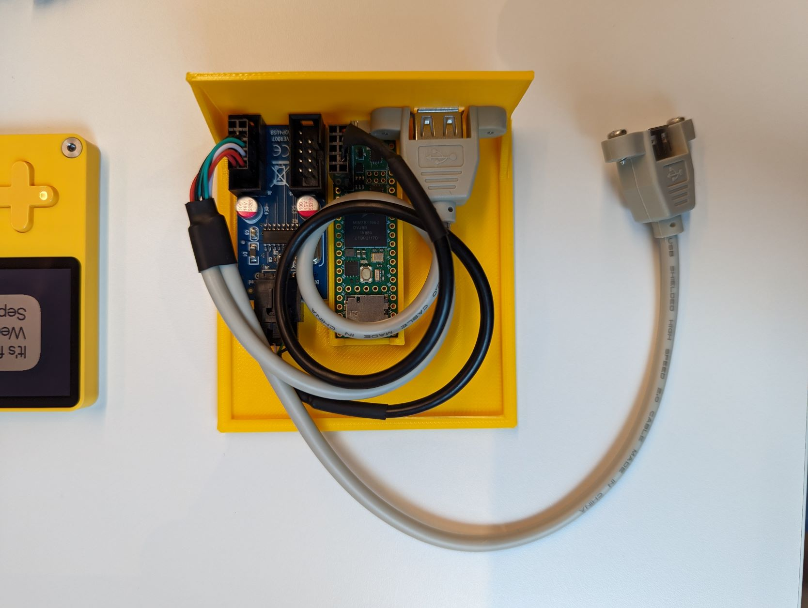
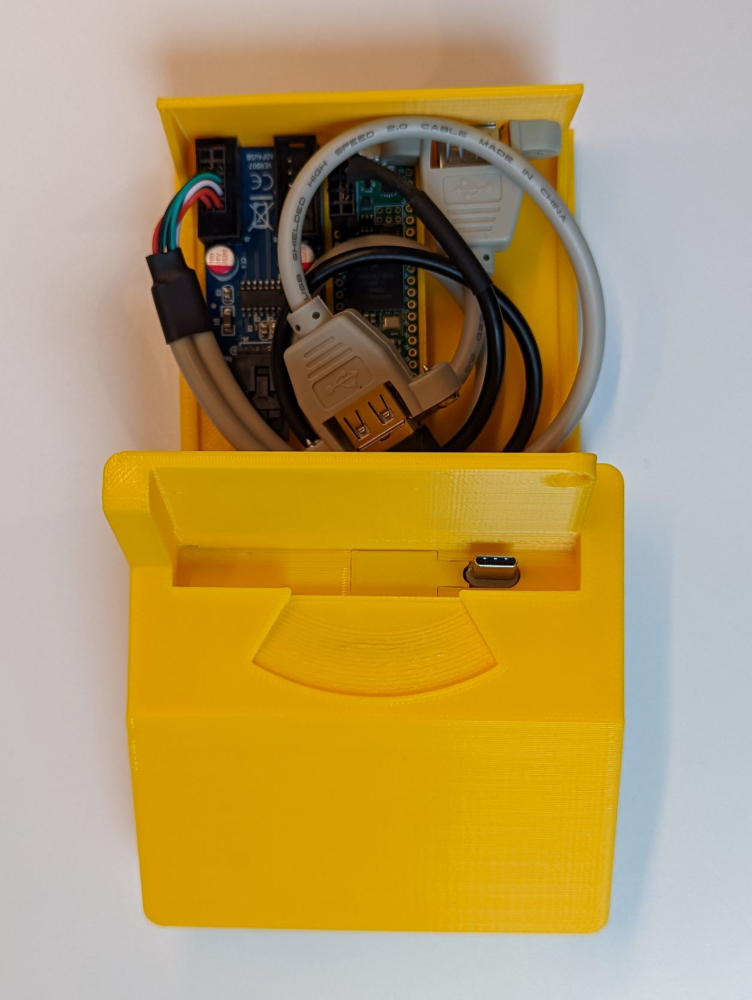

# Playwrite dock CAD files

This folder contains the FCStd ([FreeCAD](https://www.freecadweb.org/)) [project file](https://github.com/t0mg/playwrite-dock/blob/master/dock/playwrite%20dock.FCStd) for the dock, as well as 3 STL exports (one for each part) ready for slicing.

## Printing

I loaded the 3 STL files into Cura and sliced them as a single print job, at 0.2mm layers using AA0.8 print core for support and AA0.4 core for the parts. It took 9 hours on an Ultimaker 3. Regardless of your printer and settings, supports are necessary for this print.

## Assembly

The project is designed to be very easy to assemble. The dock could be made quite a bit slimmer by using custom-built cables at the cost of requiring a lot more soldering.

### 1. USB C connector

This dock was designed specifically for [this USB A to angled USB C cable](https://www.amazon.fr/gp/product/B07H95NY5Y). The USB C male connector slides in the dedicated slot in the main part of the dock, then the small cover piece can be press-fit from the top to hide the opening.
    
### 2. Teensy

The bottom tray is designed to host the [Teensy 4.1](https://www.pjrc.com/store/teensy41.html) development board. It's a snug fit, insert the USB connector into the hole first, then press the Teensy down into the tray. Access the SD card slot was preserved, even though this project doesn't use it. You'll need to solder a 4 pin header connector to the USB host port prior to installing the Teensy.

### 3. USB hub

To connect more than 1 device at a time, I used [this USB 2.0 Hub](https://www.amazon.fr/gp/product/B088H6221R) intended for desktop PCs, which connects to the Teensy header. It came with doublesided tape, which makes positioning it in the dock tray very straightforward.

### 4. USB sockets

Finally I used [standard USB extension ports](https://www.amazon.fr/gp/product/B06XCVSPZ1) also meant for desktop PCs. You only need one of these cables since they each have 2 USB connectors each. One goes to the tray's backplate and is held by the 2 original screws, it will host the gamepad or keyboard. The other remains inside the dock and connects to the Playdate via the USB A to USB C cable. The tray can then be slid into the upper piece of the dock (no locking system, it is tight enough to hold in place by itself).

 

 

### Credits

- [Teensy 4.1 model by Hasanain Shuja](https://grabcad.com/library/teensy-4-1-2)
